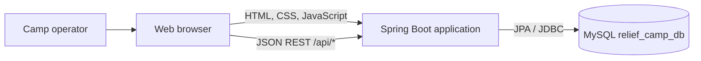
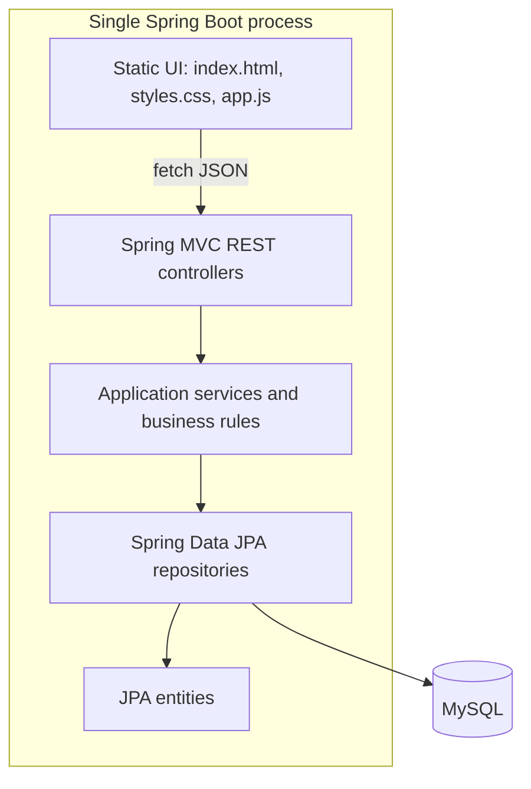
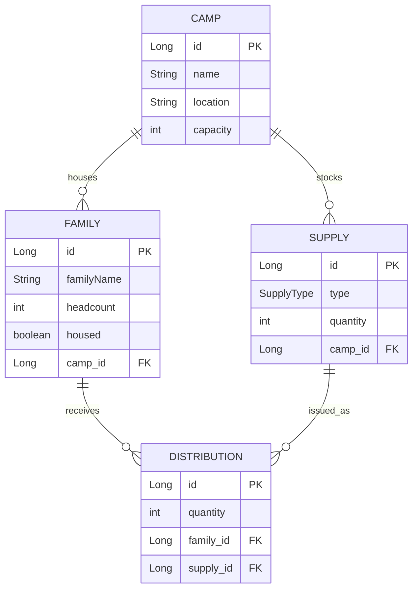

# Relief Camp Manager - System Architecture

## 1. Executive Summary

Relief Camp Manager is a small, single-deployable Spring Boot web application for recording relief camps, housed families, camp inventory, and supply distributions. It combines a server-served static asset origin with a JSON REST API in one application process. Spring MVC handles HTTP requests, service classes implement business rules, Spring Data JPA persists entities, and MySQL is the configured relational database.

This is a layered monolith, not a set of independently deployed services. All business capabilities share one JVM, one application configuration, and one database. There are no external integrations or asynchronous processing components visible in the current codebase.

## 2. Scope and Evidence

This document describes the implementation found in the source tree and configuration. Recommendations are explicitly identified as future work; they should not be read as existing capabilities. No deployment manifests, CI configuration, authentication setup, or external infrastructure definitions were present in the inspected project files.

## 3. Context and Runtime Topology

The browser loads `/`, `/styles.css`, and `/app.js` from the same Spring Boot origin. The JavaScript calls relative `/api/...` paths using `fetch`, so the current UI/API arrangement is same-origin and does not require a separately hosted frontend or configured cross-origin access.

The application is configured to connect to `jdbc:mysql://localhost:3306/relief_camp_db`. It therefore expects a MySQL server and database to be reachable at that address when the application initializes. The checked-in configuration specifies database username and password values directly; see the operational risks below.

## 4. Component Architecture

| Layer | Responsibility | Current implementation |
|---|---|---|
| Presentation | Browser workflows and API endpoint adapters | Static HTML/JavaScript under `src/main/resources/static`; four `@RestController` classes |
| Application/domain | Enforce camp, family, stock, and distribution rules | `CampService`, `FamilyService`, `SupplyService`, `DistributionService` |
| Persistence | Query and save records | Four `JpaRepository` interfaces with Spring Data-derived query methods |
| Data model | Persisted entities and relationships | `Camp`, `Family`, `Supply`, `Distribution`; `SupplyType` enum |
| Database | Durable relational state | MySQL, configured by `application.properties` |

`ReliefCampApiApplication` is the Spring Boot entry point. Component scanning and auto-configuration wire controllers, services, repositories, the web server, and JPA from the common `com.example.relief_camp_api` package tree.

## 5. Technology and Build

- Java 21.
- Spring Boot 4.1.1.
- Spring MVC through `spring-boot-starter-webmvc`.
- Spring Data JPA through `spring-boot-starter-data-jpa`.
- MySQL Connector/J at runtime.
- Maven Wrapper (`mvnw` / `mvnw.cmd`) and Spring Boot Maven plugin.
- Test dependencies for JPA and Web MVC; current test source contains only a Spring application-context load test.

No separate frontend build pipeline or JavaScript package manager is defined in the project. Static assets are packaged with the application.

## 6. Data Model

- `Camp` stores identifying details and the maximum occupancy (`capacity`).
- `Family` belongs to exactly one camp (`camp_id`, non-null), records its headcount, and uses `housed` to represent current occupancy. The family record remains after checkout.
- `Supply` belongs to exactly one camp and stores the currently available quantity for a `SupplyType` (`FOOD`, `WATER`, or `BLANKETS`). A unique constraint prevents duplicate supply types for a camp.
- `Distribution` connects one family to one supply and records the issued quantity. Its camp is derived through `distribution.supply.camp`; it does not have its own `camp_id`.
- The entity associations are unidirectional `ManyToOne` relationships and currently use eager fetches. Entity IDs use database identity generation.

The model has no explicit timestamps, user/audit identity, soft-delete fields, or immutable supply receipt records. In particular, inventory is represented as a mutable current balance, while distribution rows represent issuance history.

## 7. API Surface

All endpoints are implemented under `/api`. The controllers serialize and accept entity objects directly rather than using separate request/response DTOs.

| Capability | Endpoint | Behavior |
|---|---|---|
| Camps | `GET /api/camps` | List camps |
| Camps | `POST /api/camps` | Create camp; returns `201` and a location URI |
| Camps | `GET /api/camps/{campId}` | Get one camp |
| Camps | `PUT /api/camps/{campId}` | Update name, location, and capacity |
| Camps | `DELETE /api/camps/{campId}` | Delete only if no family or supply rows exist; returns `204` |
| Families | `GET /api/camps/{campId}/families` | List currently housed families for a camp |
| Families | `POST /api/camps/{campId}/families` | Check in a family |
| Families | `PUT /api/camps/{campId}/families/{familyId}` | Update family name/headcount |
| Families | `PUT /api/camps/{campId}/families/{familyId}/checkout` | Mark a family as no longer housed |
| Families | `DELETE /api/camps/{campId}/families/{familyId}` | Delete only if it has no distribution history |
| Inventory | `GET /api/camps/{campId}/inventory` | List supplies and current quantities |
| Inventory | `POST /api/camps/{campId}/supplies` | Receive quantity; adds it to the camp/type balance |
| Inventory | `PUT /api/camps/{campId}/supplies/{supplyId}` | Replace supply type and available quantity |
| Inventory | `DELETE /api/camps/{campId}/supplies/{supplyId}` | Delete only if it has no distribution history |
| Distributions | `POST /api/families/{familyId}/distributions/{supplyId}?quantity={n}` | Issue a quantity from a supply to a family |
| Distributions | `GET /api/camps/{campId}/distributions` | List distribution records by the supply's camp |
| Distributions | `GET /api/distributions/{distributionId}` | Get one distribution |
| Distributions | `PUT /api/distributions/{distributionId}` | Change its quantity and reconcile inventory |
| Distributions | `DELETE /api/distributions/{distributionId}` | Delete it and return its quantity to inventory |

Not-found cases and business-rule violations are raised as `ResponseStatusException`s. Expected conflict cases include insufficient camp capacity, insufficient stock, a family or supply with distribution history, and attempts to delete non-empty camps.

## 8. Key Business Flows

### Check in a family

1. The controller passes the camp ID and family payload to `FamilyService`.
2. The service resolves the camp and sums headcounts for currently housed families.
3. If adding the new headcount would exceed capacity, the request is rejected with a conflict.
4. The service assigns the camp, forces `housed=true`, clears any incoming ID, and persists the family.

Occupancy is calculated from the housed family rows rather than stored as a separate counter.

### Receive supplies

1. The service verifies that the camp exists.
2. It finds the camp's row for the requested supply type, or creates one.
3. It adds the received quantity to the existing available balance and saves the row.

### Distribute supplies

1. The service loads the family and supply and verifies that the family is housed and both belong to the same camp.
2. It checks that quantity is positive and that enough quantity is available.
3. Within a transaction, it decrements the supply balance and inserts the distribution record.

Editing a distribution applies the difference between old and new distribution quantity to the current stock balance. Deleting a distribution returns its quantity to the supply balance. These mutations are transactional at the service method boundary.

## 9. Browser Client Behavior

The UI is a single-page, dependency-free JavaScript application, not a separately compiled SPA. It supports choosing/creating/editing/deleting camps; checking in, editing, checking out, and deleting families; receiving/editing/deleting inventory; and recording/editing/deleting/viewing distributions. The selected camp drives tab content and the API paths. Distribution view loads the camp's distribution list, families, and inventory in parallel to populate the form.

The browser applies HTML escaping to displayed names and values inserted into result rows, and reports fetch failures in a shared notice area. Form-level required/minimum constraints exist in HTML; equivalent server-side Bean Validation annotations are not present in the inspected entity classes or controllers.

## 10. Deployment and Configuration View

The intended deployment unit is one Spring Boot executable/application process plus a MySQL service. The current repository does not define a container image, orchestration manifest, reverse proxy, separate static host, or production environment profile.

Configuration currently sets:

- `spring.datasource.url=jdbc:mysql://localhost:3306/relief_camp_db`
- Explicit username and password values in the properties file.
- `spring.jpa.hibernate.ddl-auto=update`, so Hibernate updates schema structures at startup.
- `spring.jpa.show-sql=true`, so generated SQL is logged.

The localhost URL is suitable only when the database is available from the same host/network namespace as the application. In a container deployment, `localhost` would refer to the application container unless the address is changed.

## 11. Security, Reliability, and Scaling Assessment

These are observations about the inspected source and configuration, not a claim that no infrastructure controls exist outside this repository.

| Area | Current state / consequence |
|---|---|
| Authentication and authorization | No Spring Security dependency or user/role checks are present. Every exposed API operation is unauthenticated in this application. This is a release blocker for deployment with non-public or personal data. |
| Credential handling | Database credentials are configured directly in `application.properties`; move secrets into deployment-managed environment/configuration before production. |
| Input validation | There are no DTOs or Bean Validation constraints on API input. The service layer checks important business conditions, but malformed/null/negative values are not uniformly guarded across all operations. |
| Database schema lifecycle | `ddl-auto=update` is enabled. This is convenient during development but does not provide reviewed, ordered migrations or controlled production rollout/rollback. |
| Concurrent updates | Stock decrement and capacity checks are read/compute/write operations without an explicit pessimistic lock, optimistic version, or atomic conditional update. Concurrent requests can over-issue stock or exceed capacity despite the single-request checks. Transactions alone do not guarantee protection from those races at common isolation levels. |
| API contract | JPA entities are the public request/response types. Persistence changes therefore affect the HTTP contract, and serialization/fetch behavior is coupled to entity mappings. |
| Observability | SQL logging is enabled; no application-specific structured logging, metrics, tracing, or health/readiness configuration is visible in the inspected files. |
| Testing | The only test source is a context-load test. Capacity, inventory reconciliation, cross-camp rejection, deletion constraints, and concurrency behavior have no visible focused tests. |
| Availability and scale | The application is a single web process and shared DB state is authoritative. Horizontal replicas are feasible only after externalizing configuration and protecting shared mutable business invariants at the database level. |
| Auditability | There is no recorded actor or timestamp. Mutable inventory balances do not show the individual receipt events that produced the balance. |

## 12. Recommended Evolution

Prioritize the following in this order if the application is moving beyond a local/demo environment:

1. **Protect access and secrets:** add authentication and role-based authorization; externalize DB credentials and use least-privilege database accounts.
2. **Make persistence changes controlled:** use a migration tool such as Flyway or Liquibase, disable Hibernate schema mutation in production, and keep schema evolution in version control.
3. **Validate at the API boundary:** introduce request/response DTOs, Bean Validation (`@Valid`), and a consistent error response format. Keep entity types internal to persistence/domain code.
4. **Enforce invariants under concurrency:** add `@Version` optimistic locking or atomic conditional SQL for inventory; define how occupancy capacity is serialized/guarded, for example by locking the camp row during check-in and headcount changes. Add a unique DB constraint for camp/type already exists.
5. **Add business and integration tests:** test capacity boundaries, checkout behavior, stock reconciliation for issue/edit/delete, same-camp validation, and transaction rollback. Run tests against a disposable MySQL-compatible database rather than relying only on a developer's local database.
6. **Improve operations:** parameterize DB URL/pool settings per environment, disable SQL statement logging in production, add health/readiness endpoints, structured logs, and basic request/error metrics.
7. **Improve audit trail as required by operations:** record actor and timestamps, and consider separate receipt/adjustment ledger entries instead of relying only on an editable current quantity.

These changes can be introduced while retaining the current layered monolith. A move to microservices is not justified by the current scope and would add operational and consistency costs without a demonstrated need.

## 13. Source Map

- Application entry point: `src/main/java/com/example/relief_camp_api/ReliefCampApiApplication.java`
- HTTP controllers: `src/main/java/com/example/relief_camp_api/controller/`
- Business services: `src/main/java/com/example/relief_camp_api/service/`
- JPA entities: `src/main/java/com/example/relief_camp_api/entity/`
- Repository interfaces: `src/main/java/com/example/relief_camp_api/repository/`
- Static UI: `src/main/resources/static/`
- Runtime configuration: `src/main/resources/application.properties`
- Build and dependencies: `pom.xml`